# paper-lloyd-data

This repository contains data for the manuscript *Generalizing Lloyd’s Algorithm for Graph Clustering
*, by Tareq Zaman, Nicolas Nytko, Ali Taghibakhshi, Scott MacLachlan, Luke Olson, and Matthew West. SIAM Journal on Scientific Computing, 2024. https://epubs.siam.org/doi/10.1137/23M1556800.

```
@article{doi:10.1137/23M1556800,
    author = {Zaman, Tareq and Nytko, Nicolas and Taghibakhshi, Ali and MacLachlan, Scott and Olson, Luke and West, Matthew},
    title = {Generalizing Lloyd’s Algorithm for Graph Clustering},
    journal = {SIAM Journal on Scientific Computing},
    volume = {46},
    number = {5},
    pages = {A2819-A2847},
    year = {2024},
    doi = {10.1137/23M1556800},
    URL = {https://doi.org/10.1137/23M1556800},
    eprint = {https://doi.org/10.1137/23M1556800}
```

**Code**

All algorithms for the paper are implemented in [PyAMG](https://github.com/pyamg/pyamg), specifically with commit  [c03b75c827788a75fb4997c9154b3611063cd204](https://github.com/pyamg/pyamg/tree/c03b75c827788a75fb4997c9154b3611063cd204).

There are a number of supporting tools for the examples, as listed in [requirements.txt](requirements.txt) and with pinned versions in [requirements-freeze.txt](requirements-freeze.txt):
  - `numpy`, `scipy`: numerical data
  - `tqdm`: status bar
  - `matplotlib`, `shapely`, `pandas`, `seaborn`: plotting

Some meshing and matrices are generated with `gmsh` and with
[Firedrake](https://www.firedrakeproject.org). The data are saved or can be
regenerated.  A full list of versions is found in
[firedrake-status.txt](firedrake-status.txt).

### Installation

Using a virtual environment, all packages (aside from Firedrake) are available in through pypi:

```
python3 -m venv lloyd-data
source ./lloyd-data/bin/activate
pip install -r requirements.txt
```

### Structure

The structure of the subdirectories generally adheres to the following format:
  - `figure.pdf`: represents the main figure in the manuscript
  - `figure_1_run.py`: executes methods presented in the paper on the problem data
  - `figure_2_plot.py`: plots the run data
  - the output data is included in this repository

The content of the subdirectories is as follows:

- `aggregation_quality`
  - `square_diameters_*.py`:
    - Distribution of the number of clusters having zero diameter for balanced Lloyd
clustering with or without tiebreaking for a $64\times 64$ mesh.
    - Distribution of the standard deviation in the number of nodes and distribution
of energy for balanced Lloyd clustering with or without tiebreaking on a
$64\times 64$ mesh.
  - `square_stats_comparison_*.py`
    - Distribution of standard deviation in diameters, distribution of standard deviation in number of nodes, and distribution in energy for different clustering methods for a $64\times 64$ mesh.
    - Difference between maximum and minimum diameters of clusters averaged over 1000 samples; Energy per node averaged over 1000 samples.
- `disc`
  - `disc_agg_*.py`
    - Example clustering and restriction matrix.
  - `disc_allmethods_*.py`
    - Example clusterings.
  - `disc_compareenergy_*.py`
    - Localizing $\beta$ to each cluster.
  - `disc_p2_*.py`
    - Additional example, P2.
  - `disc_varynaggs_*.py`
    - Example clustering patterns with the number of clusters ranging from 5 to 250 using rebalanced Lloyd clustering.
    - Example convergence for two-level AMG with different clusterings.
  - `disc_wpd_stats_*.py`
    - Work per digit (WPD) of accuracy and convergence $\rho$ for clustering sizes ranging from 3--19 points per cluster (on average) using rebalanced Lloyd clustering.
- `restricted_channel`
  - `restricted_channel_2d_*.py`
    - Additional example, 2D restricted channel.
  - `restricted_channel_3d_*.py`
    - Additional example, 2D restricted channel.
- `unit_square`
  - `anisotropic_*.py`
    - Additional example, anisotropic diffusion.
  - `bad_aggs_*.py`
    - Two example clusterings from Lloyd clustering on a $6 \times 6$ mesh.
- `actii`
  - `actii_*.py`
    - Additional example, ACTII mesh.

### Image Gallery

| directory | image |
| --------- | :---- |
| `disc` | 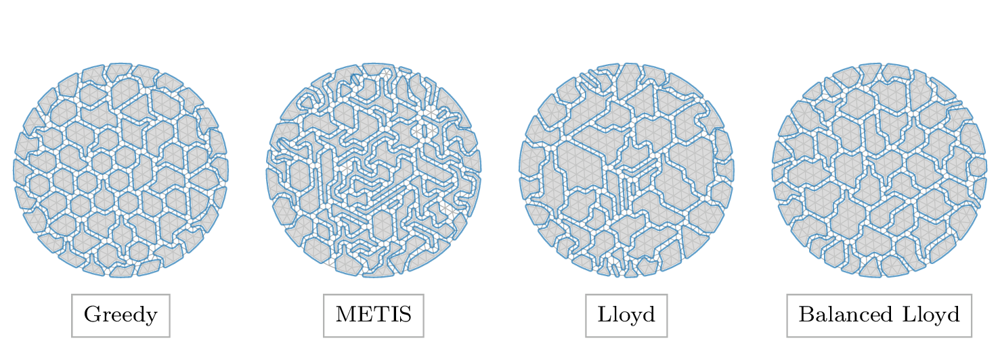 |
| `disc` | 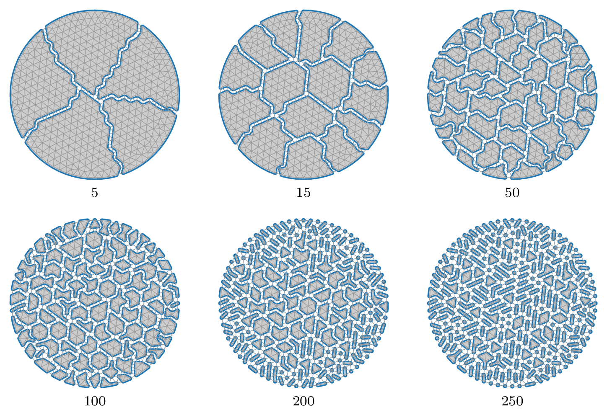 |
| `disc` |  |
| `disc` |  |
| `disc` | 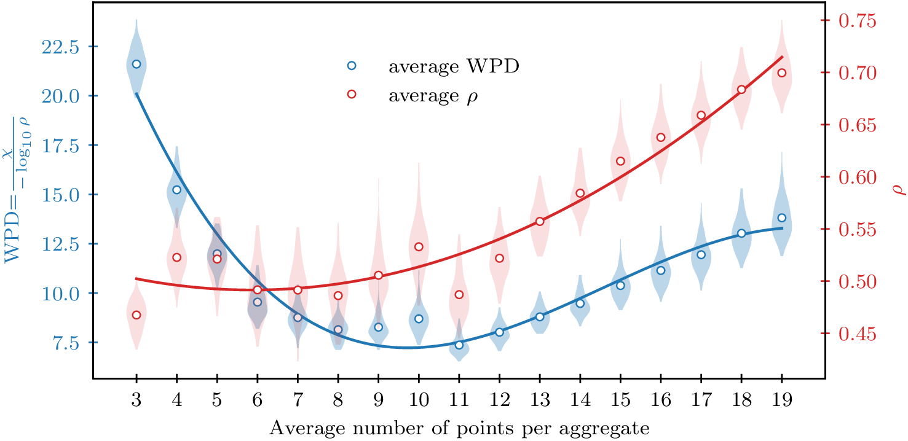 |
| `disc` | 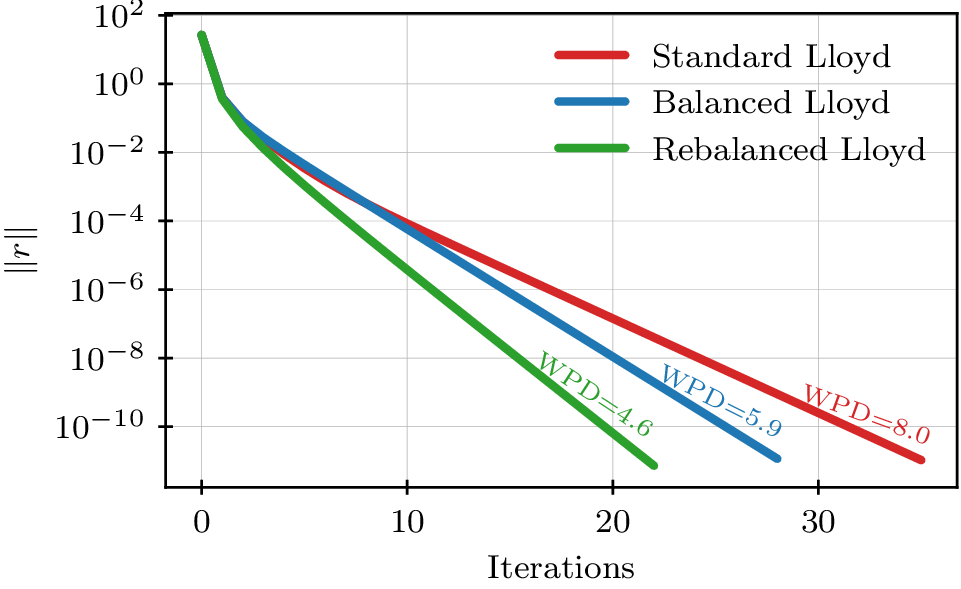 |
| `disc` | 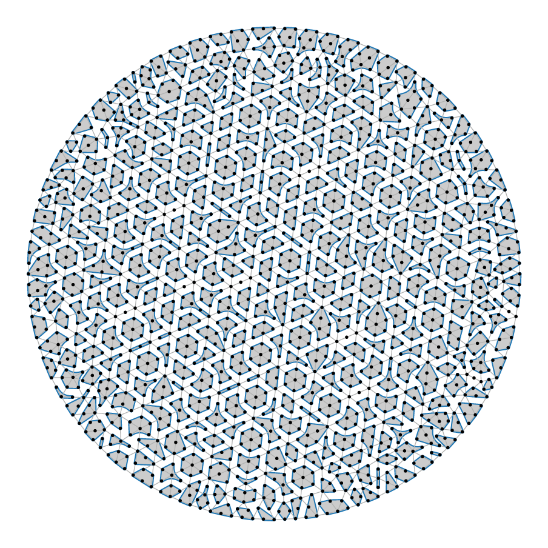 |
| `disc` |  |
| `unit_square` | 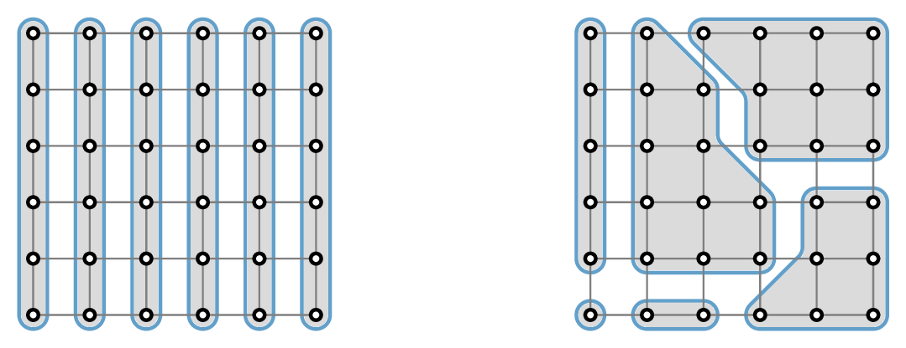 |
| `unit_square` | 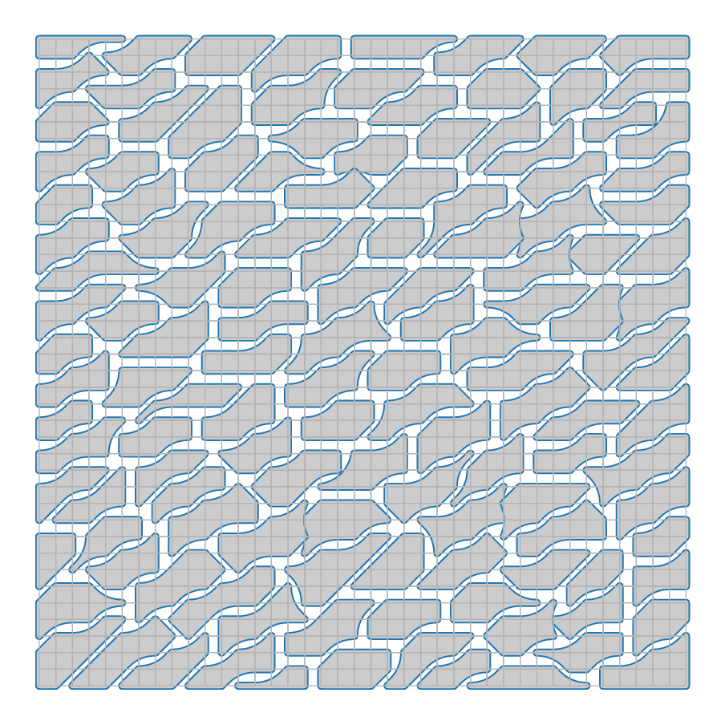 |
| `unit_square` | 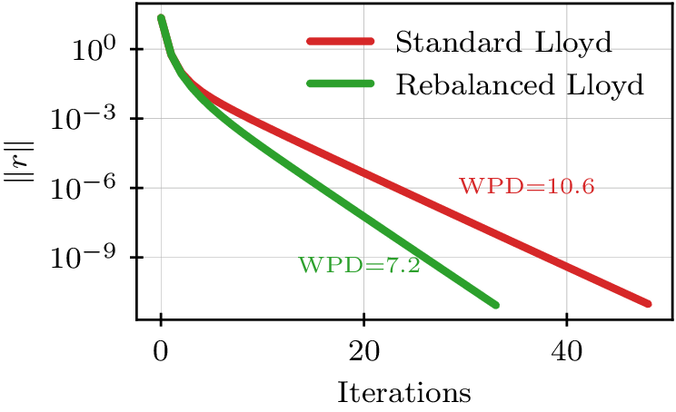 |
| `restricted_channel` | 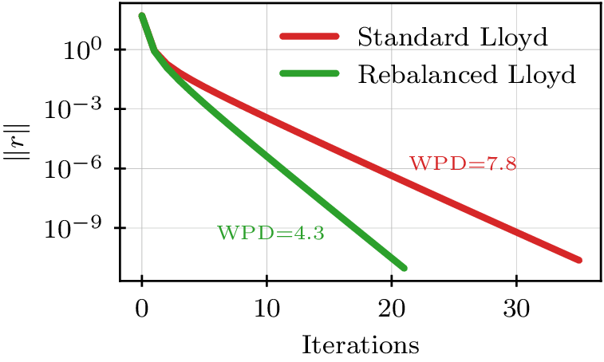 |
| `restricted_channel` | 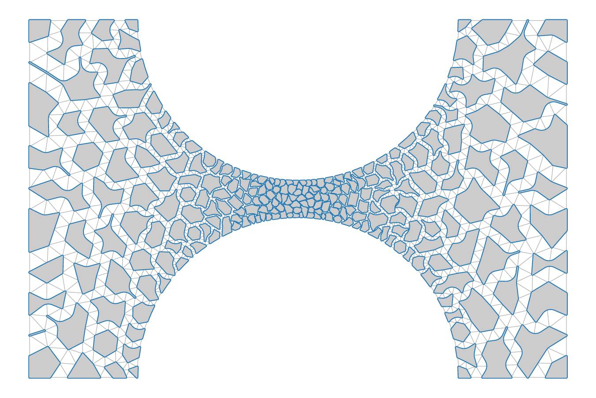 |
| `restricted_channel` |  |
| `restricted_channel` | 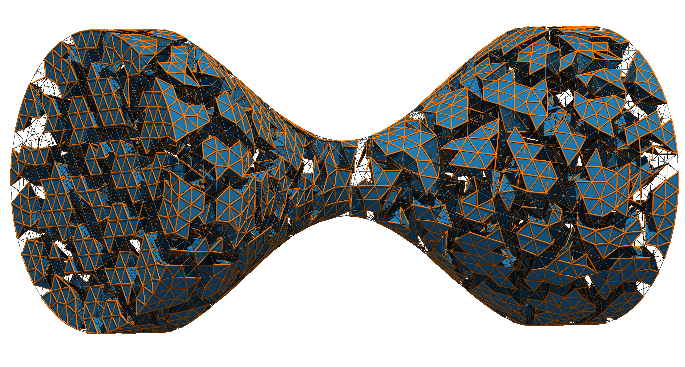 |
| `aggregation_quality` | 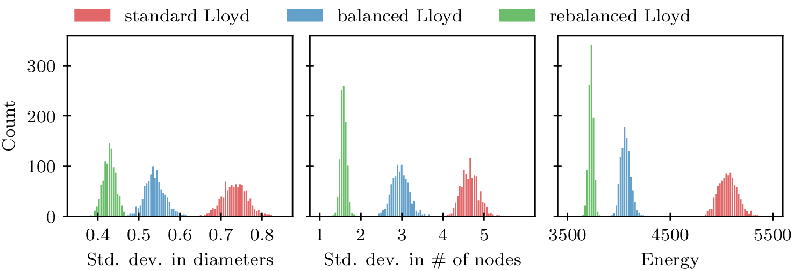 |
| `aggregation_quality` | 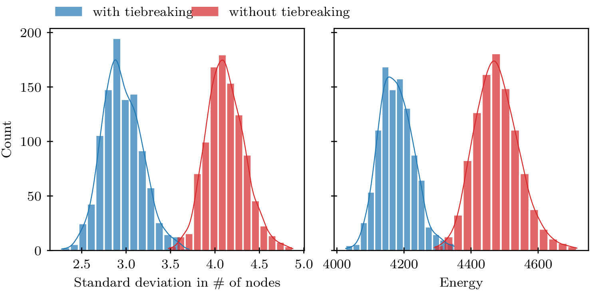 |
| `aggregation_quality` |  |
| `aggregation_quality` | 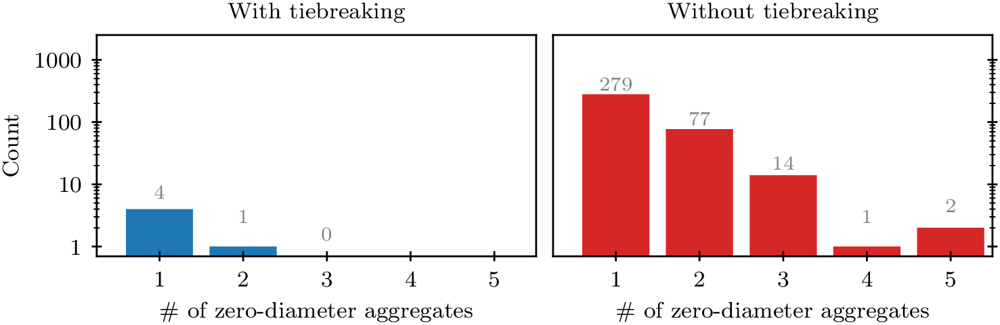 |
| `actii` |  |
